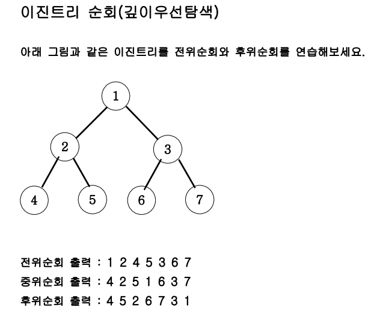
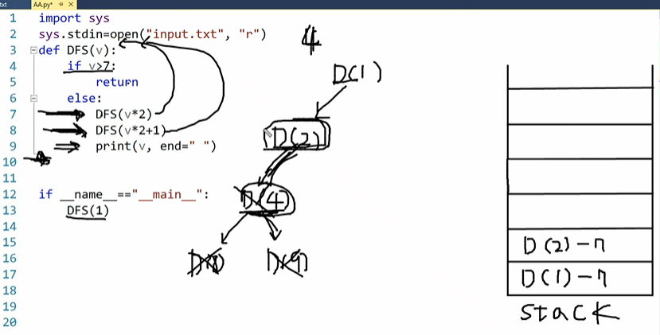
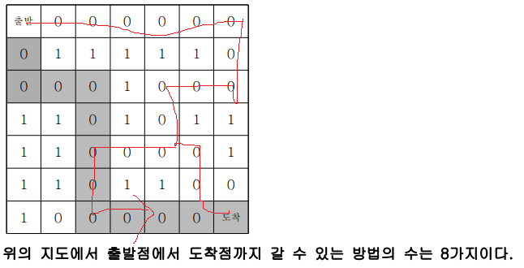
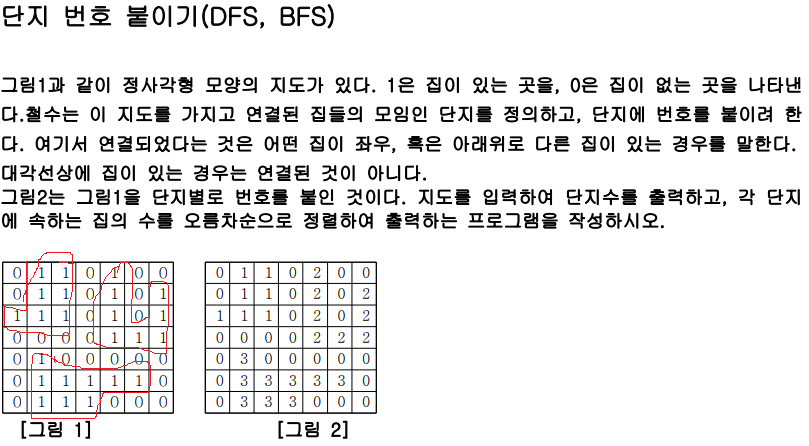
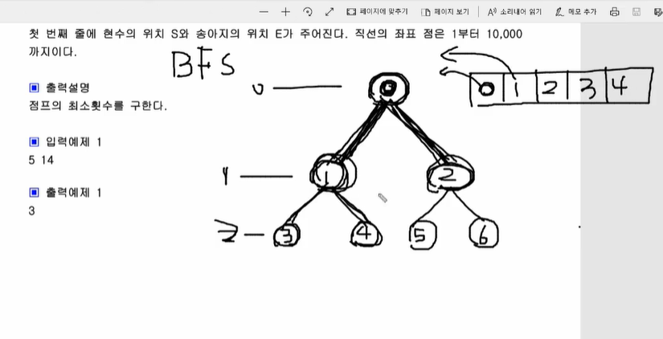
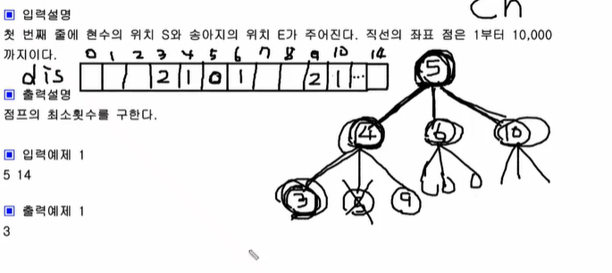

# DFS

> 재귀함수의 심화판
>
> 문제에서 트리를 어떻게 만드느냐가 핵심

## 개념





- 저렇게 stack을 적으면서 연습하다가 나중에는 stack을 그리지 않고 저절로 이진트리가 연상되면서 어떻게 진행되고있는지 알 수 있어야 함

## 유형

- N개에서 M개를 선택해서 사용해야되는 경우일때(nCm)
- 길찾기 문제(2차원 배열) 

## 코드 예제

```python
def dfs(x,y):
    global cnt
    if x==6 and y==6:
        cnt+=1
        return
    for i in range(4):
        xx=dx[i]+x
        yy=dy[i]+y
        if 0<=xx<7 and 0<=yy<7:
            if ch[xx][yy]==0 and a[xx][yy]==0:
                ch[xx][yy]=1
                dfs(xx,yy)
                ch[xx][yy]=0

if __name__=="__main__":
    a=[list(map(int,input().split())) for _ in range(7)]
    ch=[[0]*7 for i in range(7)] # 중복 체크
    ch[0][0]=1
    dx=[-1,0,1,0]
    dy=[0,-1,0,1]
    cnt=0
    dfs(0,0)
    print(cnt)
```

## dfs() 이후에 중복 체크 해제 유무 차이

> `dfs()`는 중복 체크 해제의 유무에 상관없이 가능한 모든 경로를 뿌리 내리면서 실행하는데 여기서 **핵심은 이전에 방문했던 곳을 또다시 방문할 수 있어야 되냐임**

### 1. `dfs()` 이후 중복 체크 해제=이전에 방문한 곳을 재방문 할 수 있어야함



```python
def dfs(x,y):
    global cnt
    if x==6 and y==6:
        cnt+=1
        return
    for i in range(4):
        xx=dx[i]+x
        yy=dy[i]+y
        if 0<=xx<7 and 0<=yy<7:
            if ch[xx][yy]==0 and a[xx][yy]==0:
                ch[xx][yy]=1 # 중복 체크
                dfs(xx,yy)
                ch[xx][yy]=0 # 중복 체크 해제
```

- 만약 중복 체크 해제가 없다면 저렇게 한번 도착한 후에 back한 다음 다른 경로로 도착하려고 할때 이미 방문한 경로가 `1`로 되어있어서 문제 발생함

### 2. `dfs()` 이후 중복 체크 해제 안함=이전에 방문한 곳을 재방문 하면 안됨



```python
def dfs(x,y):
    global cnt
    cnt+=1
    a[x][y]=0 # 중복 체크
    for i in range(4):
        xx=dx[i]+x
        yy=dy[i]+y
        if 0<=xx<n and 0<=yy<n:
            if a[xx][yy]==1:
                dfs(xx,yy)
				# 중복 체크 해제 없음
```

- 중복 체크 해제가 있든 없든 가능한 모든 경로를 탐색하는데 (핵심은 이전에 방문했던 곳을 다시 방문할 수 있어야 되냐임) 여기서 이미 방문한 곳을 재방문하면 중복으로 카운팅되므로 중복 체크 해제를 하면 안됨

## 시간복잡도

- O(2^n)

# BFS

> 반복문
>
> deque를 이용함

## 개념

- 현재 노드의 값을 `deque`에서 `popleft()`로 꺼낸 값으로 잡음
- 자식 노드(자손 노드 아님)의 값을 `deque.append()`로 추가하자
- 핵심은 깊이(depth)임
    - 깊이를 저장할 리스트를 따로 만들어서 `dis[next]=dis[now]+1`로 저장하자





## 코드 예제

```python
s,e=map(int,input().split())
d=deque()
ch=[0]*10001 # 중복 체크
res=[0]*10001 # 깊이 저장
d.append(s)
ch[s]=1
res[s]=0
while True:
	now=d.popleft()
    if now==e:
    	break
    for x in (now+1,now-1,now+5):
        if 0<x<=10000 and ch[x]==0:
        	d.append(x)
            ch[x]=1
            res[x]=res[now]+1
print(res[e])
```

