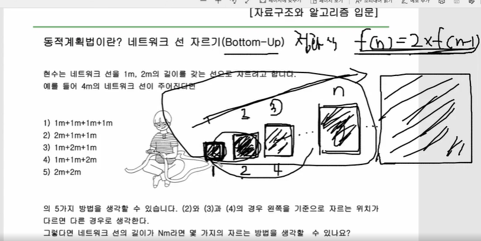
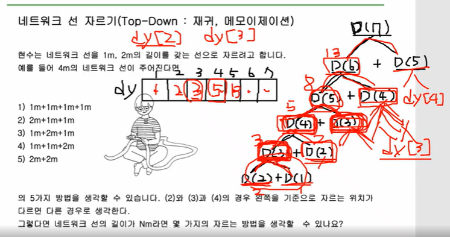

# 다이나믹 알고리즘(동적계획법)

> 다이나믹 알고리즘(DP)=동적 알고리즘=큰 문제를 작은 문제로 쪼개고 그 문제의 값을 사용해서 큰 문제의 값을 구하는 알고리즘=점화식 사용

- 핵심은 점화식을 사용하는 알고리즘(`f(n)=2*f(n-1)`같이..)

## bottom-up(찐 DP)

> 작은 문제의 값을 사용해(bottom) 큰 문제의 값을 구하는(up) 방법
>
> 이 방법이 진짜 DP임



```python
if __name__=="__main__":
    n=int(input())
    dy=[0]*(n+1)
    dy[1]=1
    dy[2]=2
    for i in range(3,n+1):
        dy[i]=dy[i-1]+dy[i-2]
    print(dy[n])
```

## top-down

> 재귀를 사용해 큰 문제에서(top) 작은 문제로 내려가면서(bottom) 문제의 값을 구하는 방법 
>
> 엄밀히 따지면 재귀 알고리즘이지만 넓은 의미에서 DP라고 보기도 함
>
> 1. 메모리제이션(리스트에 저장)해서 컷오프하는 방식
> 2. 재귀 자체가 점화식과 비슷한 모양이라서



```python
def dfs(x):
    if dy[x]!=0: # 재귀 도는 가짓수를 줄이기 위해 메모리제이션 이용
        return dy[x]
    if x==1:
        return 1
    if x==2:
        return 2
    dy[x]=dfs(x-1)+dfs(x-2) # 메모리제이션 사용
    return dy[x]

if __name__=="__main__":
    n=int(input())
    dy=[0]*(n+1)
    print(dfs(n))
```

## 유형

- LIS(최대 부분 증가수열) #A8-4.py -> LIS의 유형도 그렇고 다이나믹의 핵심은 맨 마지막 부분을 고정시켜놓고(제외했을때) 될 수 있는 경우의 수를 구하는게 핵심!
