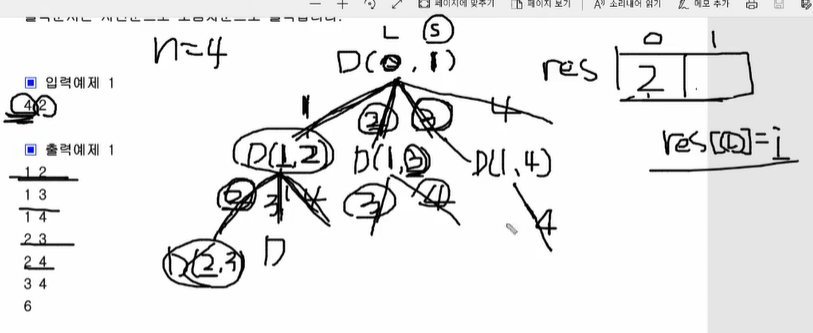

# 순열과 조합

- `dfs()`를 사용해서 푸는 유형
- 순열: 순서가 중요함(`1 2 3 4`!=`3 1 2 4`)
- 조합: 순서가 중요하지 않음(`1 2 3 4`==`3 1 2 4`)

## 푸는 방법

### 중복을 제외할때

- `1 1 2 3`처럼 1이 중복되면 안될때 사용

```python
def dfs(x):
	...
    for i in range(1,n):
        if ch[i]==0: # 중복 체크
            ch[i]=1 # 탐색을 할때
            dfs(x+1)
            ch[i]=0 # 탐색 끝나고 다시 back할때 
```

### 특정 숫자 이상만 나와야될때(조합)



- `3 1 2 4`==`1 2 3 4`처럼 순서가 필요없을때

```python
def dfs(L,S): # S=start(start이상의 숫자만 다루기 위해)
	...
    for i in range(s,n+1):
        res[L]=i
        dfs(L+1,i+1)
```

 ### 라이브러리 사용

> 라이브러리를 막는 곳도 많으므로 기본적으로는 라이브러리 없이 할 줄 알아야 함

```python
import itertools as it

a=[1,2,3,4]
for tmp in it.permutations(a,3) # 리스트 a에서 3개의 순열을 자동으로 만들어줌

for tmp in it.combinations(a,3) # 리스트 a에서 3개의 조합을 자동으로 만들어줌
```

