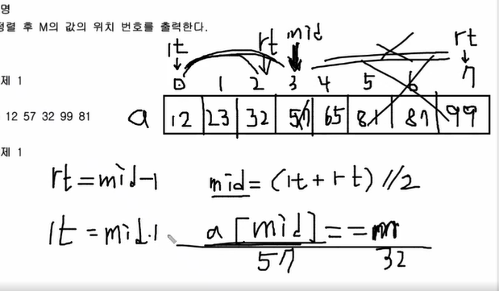

# 이진탐색 알고리즘=결정 알고리즘

## 원리



```python
lt=0
rt=len(a)-1
while lt<=rt:
	mid=(lt+rt)//2
	if a[mid]==target:
    	return mid+1 // 인덱스 값이 아니라 1부터 몇번째에 있는지 찾는 문제라서.
    elif a[mid]<target:
    	lt=mid+1
	else: # a[mid]>target
        rt=mid-1

```

## 전제조건

- 일반적으로는 탐색 리스트가 정렬된 후에 이진 탐색을 사용할 수 있음(리스트의 값을 기준으로 비교할때는)
- 그러나 리스트의 값을 기준으로 비교하지 않는다면 정렬되지 않은 상태에서 이진 탐색을 사용할 수 있음

## 써야되는 문제

- 답이 특정 범위 안에 들어있을때
- 

## 시간복잡도

- 1024->512->256->....

실행할수록 경우의 수가 `/2`로 줄어드므로 시간복잡도는 `logN`

