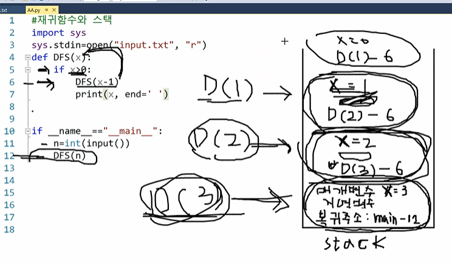

# 재귀함수

- 간단하게 말하면 반복문이지만 스택으로 쌓아서 반복함
- 재귀함수 중에 return문이 실행하면 스택 맨 상단에서 현재 실행중인 함수가 `pop()`되고 바로 밑의 함수가 실행됨

## 주의할점

- 파이썬에서는 한번에 큰 크기의 테스트 코드를 실행했을때 타임 리밋이 날 수 있음. 백준같은 사이트에서 코드를 재귀로 제출할때 `sys.setrecurtionlimit(10**6)`를 정의해야지 테스트가 통과되는 경우가 많음

## 예시



```python
 # print문이 재귀반복문 기준 위,아래 어디에 위치하냐에 따라 완전히 달라짐
    # print(x,end=' ') # dfs 트리에서 앞으로 진행할때 실행됨
    DFS(x-1)
    # print(x,end=' ') # dfs 트리에서 back될때 실행됨
```

- `if __name__=="__main__":`: 메인 함수를 나타내므로 실행하자맘자 이 함수부터 실행됨
- 재귀함수를 호출할때마다 해당 재귀함수가 `stack`에 쌓이는데 그 안에는 매개변수와 지역변수, 복귀주소가 들어있음.
- 복귀주소: 해당 `stack`을 마치고나서 다시 복귀해야될 주소를 나타내지만 코드적으로는 몇번째 줄로 돌아가서 실행하면 된다고 이해하면 됨
    - DFS(2)-6: 매개변수가 2인 재귀함수 DFS()에서 6번째줄부터 다시 실행하라