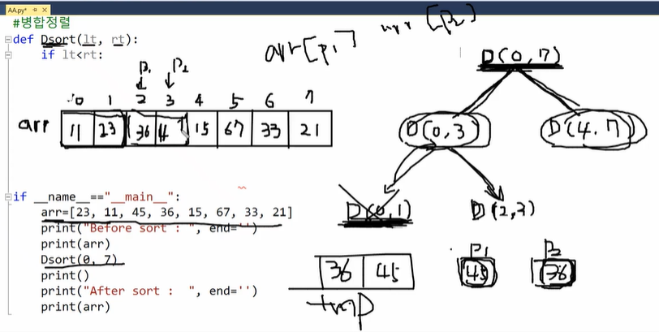
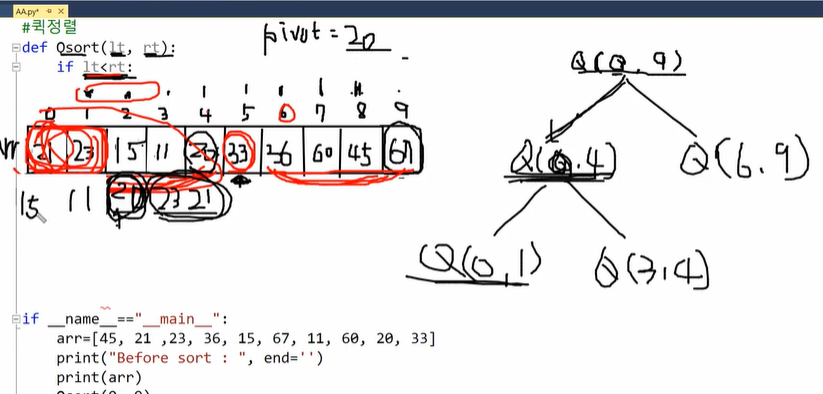

# 정렬

## 분할 정복 알고리즘

### 병합 정렬

> 병합=둘 이상의 단체 따위가 하나로 합쳐짐
>
> 병합 정렬=나눠진 것들이 하나로 합쳐지면서 정렬됨



- 전체 리스트를 반으로 나눠서(`(lt+rt)//2`) 정렬 후 이 나눠진 것들을 합치면서 또 정렬함
- 부모부터 정렬하는 퀵 정렬과 다르게, 병합 정렬은 자식이 먼저 정렬된 후에 부모를 정렬함

```python
def Dsort(lt,rt): # 병합 정렬
    if lt<rt:
        mid=(lt+rt)//2
        Dsort(lt,mid)
        Dsort(mid+1,rt)
        
        p1=lt
        p2=mid+1
        tmp=[]
        while p1<=mid and p2<=rt:
            if arr[p1]<arr[p2]:
                tmp.append(arr[p1])
                p1+=1
            else:
                tmp.append(arr[p2])
                p2+=1
        if p1<=mid:
            tmp=tmp+arr[p1:mid+1]
        if p2<=rt:
            tmp=tmp+arr[p2:rt+1]
        for i in range(len(tmp)):
            arr[lt+i]=tmp[i]

if __name__=="__main__":
    arr=[23,11,45,36,15,67,33,21]
    print('before sort:',arr)
    Dsort(0,7)
    print()
    print('after sort:',arr)
```

### 퀵 정렬

> 퀵(quick) 정렬=평균적으로 매우 빠른 속도로 정렬하는 방식이라 퀵 정렬



- 어느 한 값을 기준으로 잡고(보통 `rt`값) 그 값보다 작은 값은 왼쪽으로 더 큰 값은 오른쪽으로 정렬함->이 과정이 다 끝나면 해당 정렬의 가운데 값과 기준값을 서로 바꾸는데 그러면 이 기준값은 제대
- 로된 위치에 정렬이 된거임
- 자식부터 정렬하는 병합 정렬과 다르게, 퀵 정렬은 부모에서부터 정렬이 되고 자식이 정렬됨

```python
def Qsort(lt,rt): # 퀵 정렬
    if lt<rt:
        pos=lt
        pivot=arr[rt]
        for i in range(lt,rt):
            if arr[i]<=pivot:
                arr[i],arr[pos]=arr[pos],arr[i]
                pos+=1
        arr[rt],arr[pos]=arr[pos],arr[rt]
        Qsort(lt,pos-1)
        Qsort(pos+1,rt)
        

if __name__=="__main__":
    arr=[45,21,23,36,15,67,11,60,20,33] 
    print('before sort:',arr)
    Dsort(0,9)
    print()
    print('after sort:',arr)
```