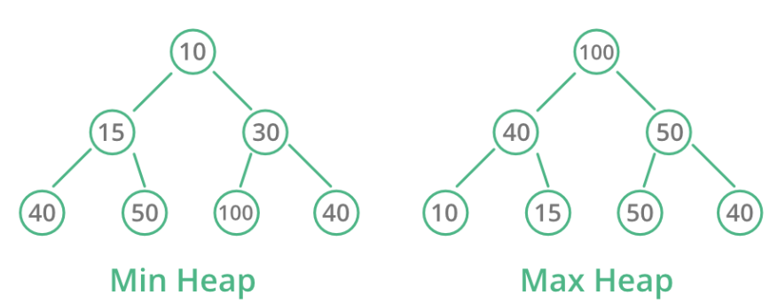

# 최소힙, 최대힙

## 개념



- 루트노드가 자식노드보다 값이 작다(최소힙)/크다(최대힙)
- 기본적으로 `heapq()`는 최소힙으로 되어있음
- 최대힙으로 바꾸려면 `h.heappush(h,-n)`으로 음수값으로 바꿔서 넣으면 됨

## 사용방법

```python
h=heapq() 
h.heappush(h,n) # heap인 h에 n값을 넣음(알아서 최소힙 정렬이 됨)
h.heappush(h,-n) # 알아서 최대힙 정렬이 됨
h.heappop(h) # 루트 노드 pop(최소/최대값이 뽑아짐)
```

